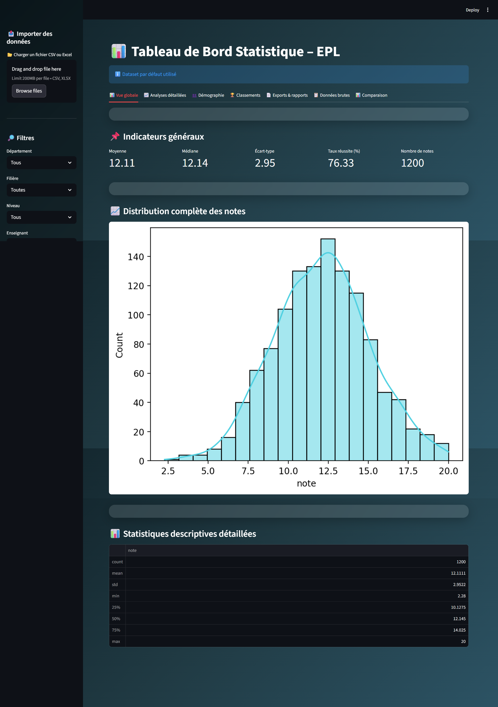
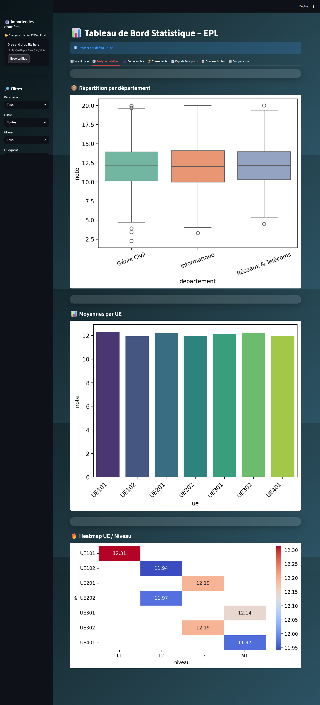
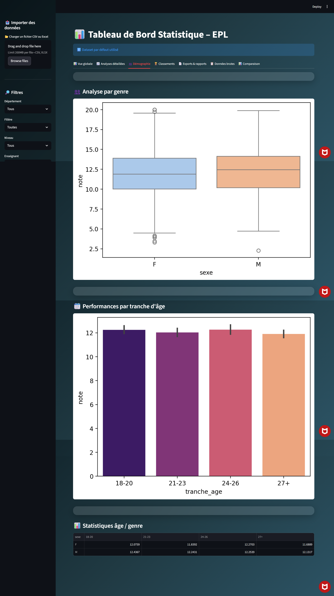
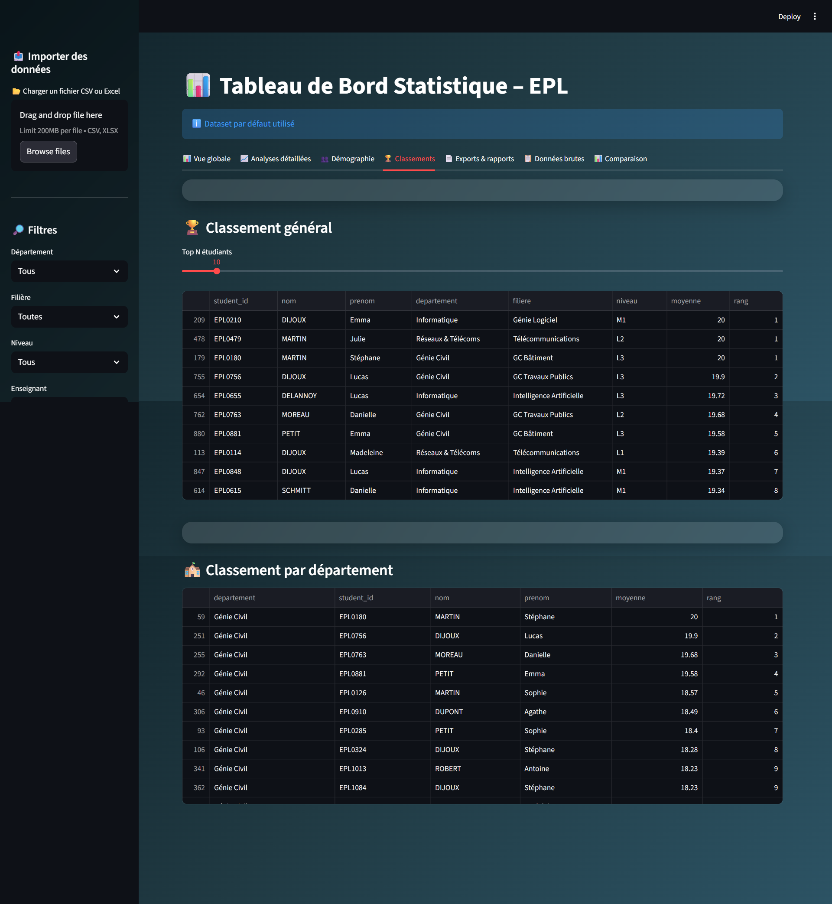
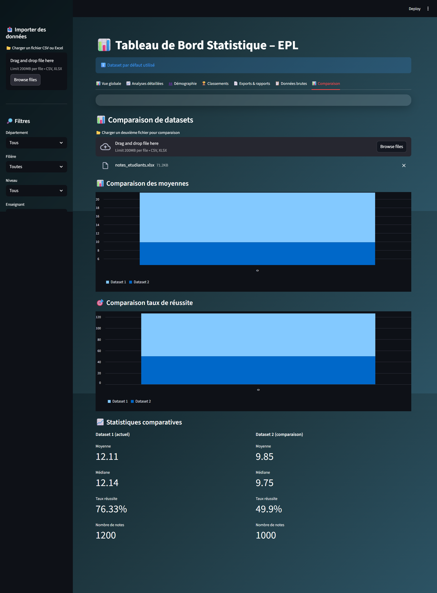
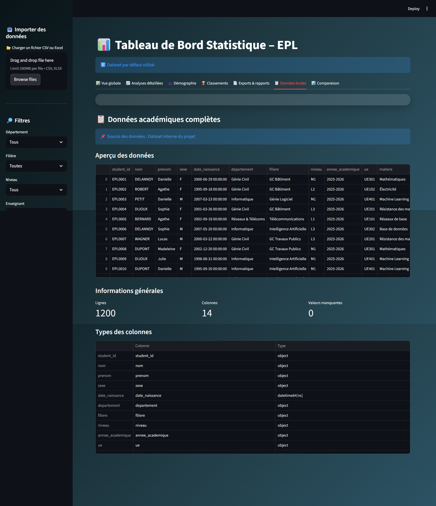

# Analyse des Notes de l’EPL – Python

## Présentation
Ce projet consiste à développer une application Python permettant
l’analyse statistique des notes des étudiants de l’EPL.

Les données sont simulées et analysées afin de produire :
- des statistiques descriptives,
- des visualisations,
- un tableau de bord interactif,
- une API de consultation,
- un classement académique,
- et un rapport PDF automatique.

---

## Objectifs pédagogiques
- Manipuler des données avec Pandas et NumPy
- Réaliser des statistiques descriptives
- Créer des visualisations en Python
- Développer une API avec FastAPI
- Concevoir un tableau de bord avec Streamlit
- Générer automatiquement un rapport PDF

---

## Structure du projet
- `data/` : données CSV et Excel simulées
- `scripts/` : génération des données, analyses, classements, PDF
- `dashboard/` : tableau de bord Streamlit
- `api/` : API FastAPI (Swagger)
- `exports/` : résultats, graphiques et rapport PDF

---

## Technologies utilisées
- Python
- Pandas, NumPy
- Matplotlib, Seaborn
- Streamlit
- FastAPI
- ReportLab

---

## Exécution du projet

### 1. Installer les dépendances
```bash
pip install -r requirements.txt
```

### 2. Générer le dataset
```bash
python scripts/generate_dataset.py
```

### 3. Lancer l'analyse statistique
```bash
python scripts/analysis_statistics.py
```

### 4. Générer les visualisations
```bash
python scripts/visualisations.py
```

### 5. Lancer le dashboard
```bash
streamlit run dashboard/app.py
```

### 6. Lancer l'API
```bash
uvicorn api.main:app --reload
```

### 7. Générer le rapport PDF
```bash
python scripts/generate_report_pdf.py
```

---

## 📊 Tableau de bord interactif

Le dashboard Streamlit offre plusieurs vues pour analyser les données :

### Vue globale


### Analyses détaillées


### Démographie


### Classements


### Comparaison


### Données brutes


---

## Résultats

- Statistiques descriptives complètes
- Visualisations graphiques
- Classements académiques
- Dashboard interactif
- API testable via Swagger
- Rapport PDF généré automatiquement